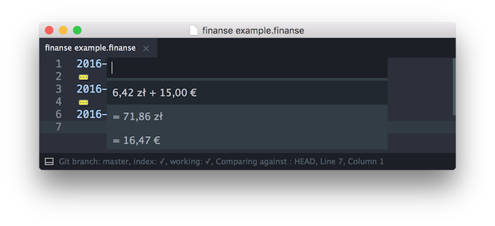

# Sublime Finanse

Sublime Text 3 plugin for expenses and transactions tracking in plain text using [finanse](https://github.com/bevesce/finanse).

 

## Installation

As long as I'm the only person using this, I don't want to pollute Package Control. So installation is manual:

```
git clone --recursive https://github.com/bevesce/SublimeFinanse.git Finanse
mv Finanse "path/to/Sublime Text 3/Packages/"
```

There's one git submodule here so you need to use `--recursive` flag.

## Features
### Syntax highlighting

Highlighting should work with every color scheme:


### Filter & sum

You can filter (by folding) transactions with *finanse* queries:


Pressing enter will show quick panel with the total amount of resulting transactions:




## License

Copyright 2016 Piotr Wilczyński. Licensed under the MIT License.